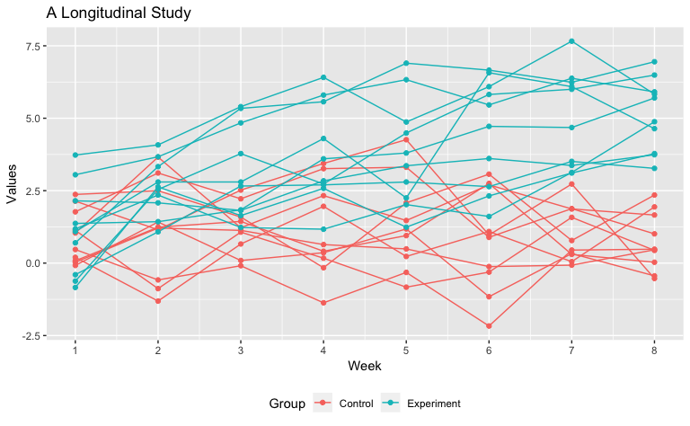
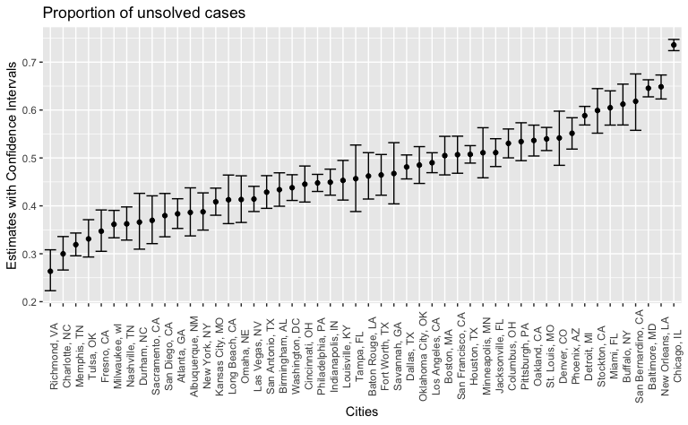

P8105 Homework 5
================
Zanis Fang, UID: ZF2213
11/1/2018

## Problem 1

``` r
# read file name
tibble(id = list.files("./data", full.names = TRUE)) %>%
    # read tables and nest into dataframe
    mutate(data = map(.x = id, .f = ~read_csv(.x))) %>% 
    # unnest
    unnest() %>% 
    # get the sample identifier and group type
  mutate(id = str_extract(id, "(con|exp)_\\d{2}"),
             group_type = str_extract(id, "con|exp"),
             group_type = fct_recode(group_type,
                                                            "Control" = "con",
                                                            "Experiment"  = "exp")
             ) %>%
    # tidy the dataset
    gather(key = "week", value = "values", "week_1":"week_8") %>% 
    # make week numeric
    mutate(week = as.numeric(str_extract(week, "[1-8]"))) %>% 
    ggplot(aes(x = week, y = values, group = id, color = group_type)) +
      geom_line() + 
      geom_point() +
      labs(
        x = "Week",
        y = "Values",
        color = "Group",
        title = "A Longitudinal Study"
      ) +
      scale_x_continuous(breaks = c(1:8)) +
      theme(
        legend.position = "bottom"
        )
```

<!-- -->

Experimental group increase over time and control group remains
unchanged overtime.

## Problem 2

Data tidying:

``` r
# read data from github repo
homicide_raw <- read_csv("https://raw.githubusercontent.com/washingtonpost/data-homicides/master/homicide-data.csv") %>% 
    # create city_state variable
    unite(col = "city_state", city:state, sep = ", ", remove = FALSE)
```

    ## Parsed with column specification:
    ## cols(
    ##   uid = col_character(),
    ##   reported_date = col_integer(),
    ##   victim_last = col_character(),
    ##   victim_first = col_character(),
    ##   victim_race = col_character(),
    ##   victim_age = col_character(),
    ##   victim_sex = col_character(),
    ##   city = col_character(),
    ##   state = col_character(),
    ##   lat = col_double(),
    ##   lon = col_double(),
    ##   disposition = col_character()
    ## )

There are 52179 rows, 13 columns. Each row describes a case with case
ID, reported date, victim’s first and last name, race, age, sex, city,
state, location, disposition.

Get number of homicides:

``` r
unsolved_homicide <- homicide_raw %>% 
    # get city total first
    group_by(city_state) %>% 
    mutate(city_total = n()) %>% 
    # then get boolean about whether solved
    group_by(solved = disposition %in% c("Closed by arrest"),
                     # also keep the two variables
                     city_state, city_total) %>%
    # get subtotal
    summarize(subtotal = n()) %>% 
    # get only unsolved
    filter(solved == FALSE) %>% ungroup()
```

Baltimore, MD:

``` r
# get data from Baltimore, MD
baltimore_homicide <- unsolved_homicide %>% filter(city_state == "Baltimore, MD")
# make prop.test results in a table
baltimore_homicide <- broom::tidy(
    # proportion test
    prop.test(
        # unsolved...
        baltimore_homicide$subtotal,
        # ...among all cases
        baltimore_homicide$city_total)
    )

baltimore_homicide[c("estimate", "conf.low", "conf.high")] %>% knitr::kable(digits = 3)
```

| estimate | conf.low | conf.high |
| -------: | -------: | --------: |
|    0.646 |    0.628 |     0.663 |

All states:

``` r
# statistics for proportion test
proptest_homicide <- unsolved_homicide %>% 
    # map prop.test to all states
    mutate(prop_test = map2(.x = subtotal, .y = city_total,
                                                    ~broom::tidy(prop.test(.x, .y))
                                                    )) %>%
    unnest() %>%
    # select necessary columns for plotting
    select(city_state, estimate, conf.low, conf.high)

# plot
proptest_homicide %>%
    ggplot(aes(x = reorder(city_state, estimate), y = estimate)) +
      # add points and errorbar
      geom_point() +
      geom_errorbar(aes(ymin = conf.low, ymax = conf.high)) +
      # label axis and change themes
      labs(
        x = "Cities",
        y = "Estimates with Confidence Intervals",
        title = "Proportion of unsolved cases"
      ) +
      theme(
        axis.text.x = element_text(angle = 90)
      )
```

<!-- -->
